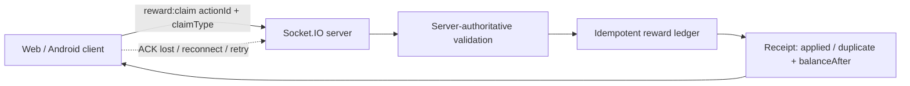

# Game Systems Reliability Lab

[](https://github.com/safal207/game-systems-reliability-lab/actions/workflows/ci.yml)

Practical QA and reliability engineering for real-time multiplayer games: economy integrity, retries, concurrency, server authority, Socket.IO behavior, load evidence, and failure recovery.

**Client review:** [Case Study](docs/CASE_STUDY.md) · [Evidence Register](docs/EVIDENCE.md) · [Automated Tests](test/socket-integration.test.js)

This is a portfolio lab built around one principle:

> A multiplayer feature is not reliable because it looks correct once. It is reliable when important invariants survive retries, reconnects, races, duplicate messages, and hostile client input.

## Portfolio Case #1 — Multiplayer Snake Reliability

The first case models a small real-time multiplayer backend and tests a high-value economic invariant:

> A client retry, duplicate event, lost acknowledgement, or concurrent duplicate claim must never create an additional reward.

The client may request an action, but the server owns reward value and state-transition authority.

### Architecture



### Automated proof

| Scenario | Invariant under test |
| --- | --- |
| Same action ID retried | Balance changes once |
| ACK is delayed, client disconnects, reconnects and retries | Outcome remains exactly-once |
| 20 clients submit the same economic action concurrently | Exactly one claim is applied; the rest are duplicates |
| Client submits `amount: 1_000_000` | Client value is ignored; server applies only the authoritative reward |
| Same action ID is reused with conflicting identity | Request is rejected as an action-ID conflict |

See [`docs/EVIDENCE.md`](docs/EVIDENCE.md) for the evidence register and explicit scope boundaries.

### What this case demonstrates

- server-authoritative economic state changes
- idempotent reward processing
- duplicate/replay protection
- lost-ACK + reconnect recovery behavior
- concurrent duplicate-action verification
- conflicting action-ID detection
- deterministic regression tests
- Socket.IO smoke-load harness
- explicit separation between `connected clients` and `healthy concurrent gameplay`

## Core invariant

For any accepted economic action ID `A`:

```text
first valid A                 -> effect may be applied once
same A retried                -> same outcome, no second effect
same A concurrently repeated  -> one applied effect, remaining requests deduplicated
same A, conflicting identity  -> reject as conflict
lost ACK + reconnect + retry  -> no duplicate reward
```

## Quick start

```bash
npm install
npm test
npm start
```

In another terminal:

```bash
npm run load:smoke -- 100
```

The final argument is the number of simulated Socket.IO clients.

## Evidence boundary

This case intentionally does **not** claim that 1,000 concurrent players have been proven.

The current proof is a single-process, in-memory reliability model. It demonstrates retry/concurrency invariants at the application boundary, not distributed exactly-once guarantees across multiple server replicas or a persistent datastore.

A production-scale 1,000-player claim should additionally include repeatable environment-controlled runs, event throughput, p50/p95/p99 latency, CPU/memory pressure, event-loop lag, network error rate, datastore contention, cross-replica correctness, state divergence checks, and explicit pass/fail thresholds.

## Repository map

```text
src/
  reward-ledger.js           # deterministic economic state + idempotency guard
  server.js                  # testable Socket.IO authoritative server

test/
  reward-ledger.test.js      # deterministic unit-level regression proof
  socket-integration.test.js # reconnect, concurrency and authority proof

scripts/
  socket-load-smoke.js       # concurrent Socket.IO smoke-load harness

docs/
  CASE_STUDY.md              # client-facing problem / approach / result
  RISK_MODEL.md              # prioritized multiplayer failure model
  TEST_STRATEGY.md           # evidence and acceptance strategy
  EVIDENCE.md                # claim-to-proof register
```

## Engineering workflow

```text
risk -> invariant -> reproducible test -> evidence -> fix -> regression proof
```

## Next cases

1. persistent idempotency across process restart
2. concurrent ownership transfer / anti-duplication
3. authoritative movement and collision consistency
4. Socket.IO saturation and explicit latency thresholds
5. multi-replica / datastore contention behavior
6. Roblox DataStore / economy reliability patterns
7. Minecraft plugin / server transaction reliability

## License

MIT
